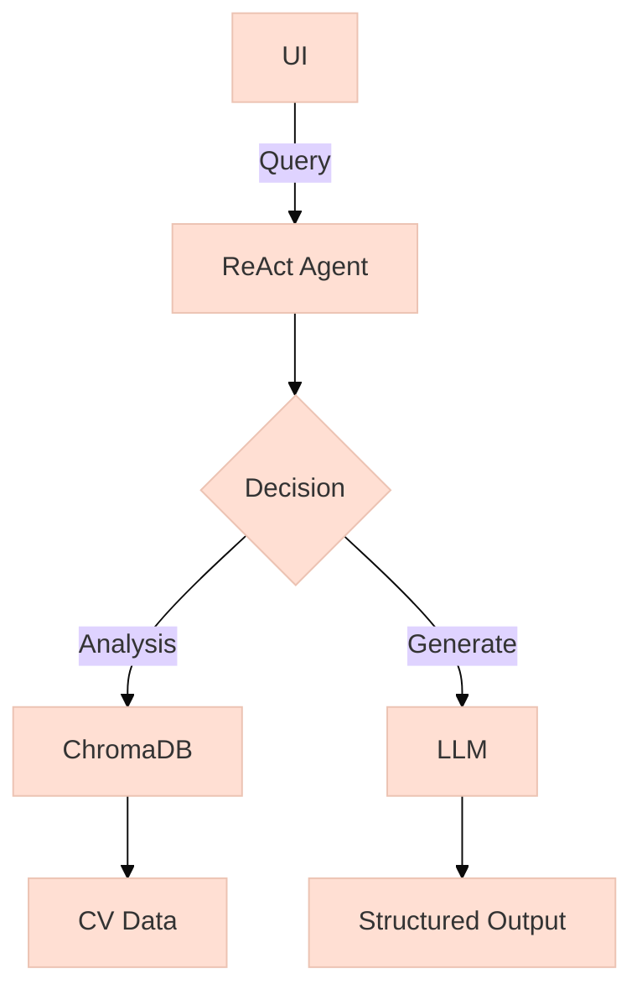

# CV Parser & Analyzer

A RAG (Retrieval Augmented Generation) application with ReAct agents for intelligent CV processing using LlamaIndex and ChromaDB.

## Key Features

### Core Modules
1. **CV Processing Pipeline**
   - Multi-format support (PDF/DOCX/TXT)
   - Automatic metadata extraction
   - Chunking with sentence overlap

### ReAct Agents
2. **Job Offer Generator**
   ```mermaid
   graph LR
      A[CV] --> B(Reasoning)
      B --> C[Personalized Offer]
      C --> D[Call-to-Action]
   ```
   - Generates tailored job offers
   - Includes competitive compensation
   - Highlights company benefits

3. **Job Match Analyzer**  
   ```mermaid
   graph LR
      A[Job Desc] --> B(Embedding)
      B --> C[Similarity Score]
      C --> D[Gap Analysis]
   ```
   - Technical matching (vector similarity)
   - Skill gap analysis
   - Improvement recommendations

## Architecture Overview



## Setup

1. Install dependencies:
```bash
pip install -r requirements.txt
```

2. Configure `.env`:
```ini
OPENAI_API_KEY=your_key
AZURE_OPENAI_ENDPOINT=your_endpoint
```

## Usage

Launch the app:
```bash
python cv_parser.py
```

Access the web interface at `http://localhost:7860`
